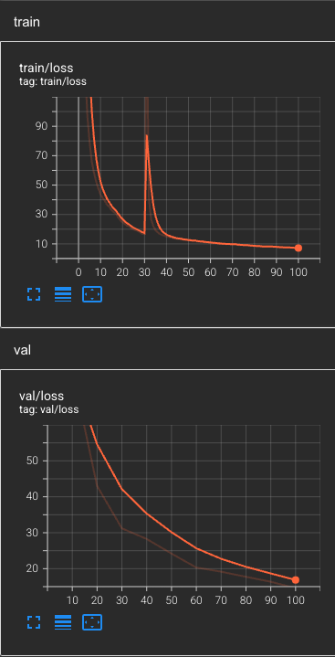
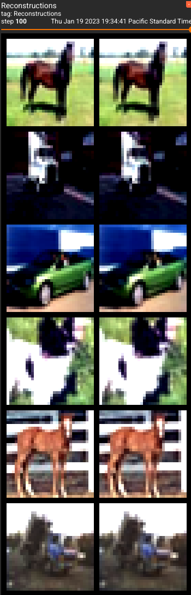

# Autoencoder

This is the implementation of the encoder/decoder blocks used in (latent diffusion)[https://github.com/CompVis/latent-diffusion/blob/main/ldm/models/autoencoder.py] which uses convolutions and attention. 

Trained on CIFAR10

Steps             |  Reconstructions
:-------------------------:|:-------------------------:
 |  

## Train

`TODO - device replication for parallel training`

```bash
pip install -r requirements.txt
```

```bash
python train_autoencoder.py
```

## Test

`test_autoencoder.py` runs through different blocks to check that they were implemented correct and that the output dimensions are as expected.

```bash
python test_autoencoder.py
```