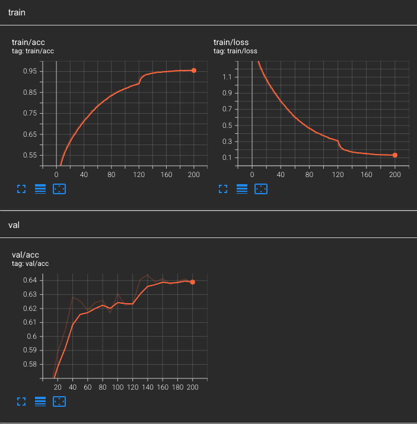

# Vision Transformer

Trained on CIFAR10




## Train

`TODO - device replication for parallel training`

```bash
pip install -r requirements.txt
```

```bash
python train_vit.py
```

## Test

`test_vit.py` runs through different blocks to check that they were implemented correct and that the output dimensions are as expected.

```bash
python test_vit.py
```